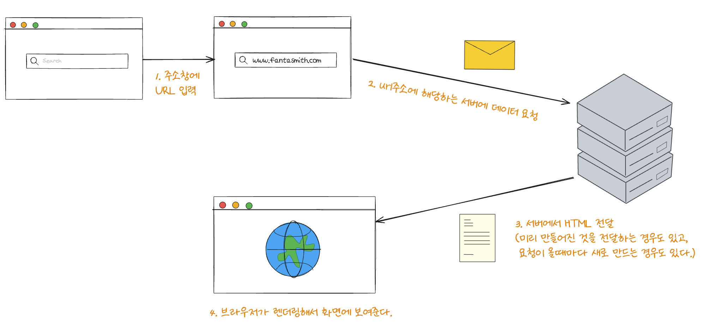

# DOM과 브라우저 렌더링

## 📚 개요
순수하게 HTML/CSS/JS를 이용해서 간단한 풀스택 개발을 경험해볼 일이 있었습니다. 
여러 불편함을 맞닥뜨리고 그걸 개선하는 과정에서 `web component`기능 중 하나인 `custom component`를 사용하게 되었고, 그 과정에서 `DOM` 객체를 깊게 다루는 경험을 할 수 있었습니다.  

다만, 그 과정이 평탄치는 않았습니다.  처음 겪어보는 경험인 만큼 정말 많은 구조적인 문제와, 불편함을 직면하게 되었죠. 그리고, 그 요소의 대부분은 제가 `DOM`과 브라우저 렌더링 과정을 제대로 이해하지 못해서 벌어진 일이었습니다.  

주먹구구식으로 학습을 하다가, `SSR`, `CSR` 에 대한 이야기도 많이 들리고, 제가 **과연 이 개념들을 제대로 이해하고 있는가?** 라는 의문도 들어서 이번 기회에 제대로 정리를 해보자는 생각에 이렇게 글을 적게 되었습니다.  

지금부터 다룰 이야기는 `DOM`이란 무엇인가와, 그리고 이 `DOM`이 브라우저에 어떻게 렌더링이 되는가에 대해 적어보고자 합니다. 

## 📚 설명 방식
저 개인적으로는 학습을 할 때 상황이 머릿속에 그려지면 좀 더 쉽게 학습을 할 수 있었습니다. 
이는 지금부터 이야기 할 내용에도 적용이 되는 부분이라고 생각합니다. 
그래서 지금부터는, 처음 브라우저의 주소창에 `URL`을 입력하였을 때부터 화면에 출력될 때 까지 어떤 일이 벌어지는 지에 대해서 이야기를 해보면서 다른 개념들을 풀어나가려 합니다. 
개념들은 과정에 따라서 설명하고, 마지막에 `SSR`과 `CSR`의 차이에 대해서 이야기를 하면서 마치고자 합니다. 자세한 내용은 목차를 참고해주시면 좋을 듯 합니다.

## 📚 도메인을 쳐서 화면에 도달하기까지

여러분, 들어가기 전에 한가지를 생각해볼까요? 
저희가 평소에 인터넷 서핑을 하기 위해서 자주 사용하는 `브라우저(Browser)`에 대해서 생각해봅시다. 
혹시 이런 의문을 품어보신 적 있으신가요?  

> 주소창에다가 특정 주소를 입력했을 때, 어떤 과정을 거쳐서 화면에 보여지게 되는 걸까?   

한번 생각해보신 적 있나요? 그리고 어떻게 동작하는 지 설명할 수 있나요? 
지금부터 저와 함께 살펴봅시다 ㅎㅎ.  

|  |
|:-----------------------------------------------------------:|
|                주소창부터 렌더링까지의 과정                 |

일반적으로 주소에 URL을 입력했을 때, 서버를 거쳐서 화면에 보여주는 과정을 간단하게 표현해 놓은 그림이에요!  
네트워크나 여러가지로 고려할 게 많지만, 일반적으로는 다음과 과정을 거쳐서 화면에 보여지게 됩니다. 
1. 사용자가 브라우저의 주소표시줄에 `URL`을 입력한다.
2. 브라우저는 해당 `URL`의 주소와 API를 바탕으로, 서버에게 HTML/CSS/JS와 같은 자원을 요청한다.
3. 서버는 들어온 요청에 맞는 HTML/CSS/JS 파일을 찾거나 만든다.
4. 찾았으면 서버는 브라우저에게 해당 자료를 넘겨준다.
5. 브라우저는 넘겨받은 자료를 해석 후, 렌더링해서 화면에 보여준다.

모든 과정을 설명하면 좋겠지만, 그러면 책 한 권이 나올지도 몰라요. 
그래서, 처음에 언급을 했듯, 우리는 3번과 5번에 집중해보고자 해요.   

참고로, 3번의 과정에서 HTML/CSS/JS를 만들면 `서버 사이드 렌더링(SSR)`이라고 하고, 4번의 과정에서 HTML이 아닌 JSON등의 포멧을 이용해서 정보를 넘겨주고, 5의 과정에서 HTML/CSS/JS을 만들고, 렌더링을 하면 그걸 바로 `클라이언트 사이드 렌더링(CSR)`이라고 한답니다! 
어렵죠? 하나씩 차근차근 살펴봅시다. 

## 📚 용어를 명확히 하는 것의 중요성
이야기를 하기 전에 한 가지를 논해보고 가면 좋을 것 같습니다. 
일상적인 지식이 아닌, 전문적인 영역을 공부하고 배운 지식을 사용할 때에, 정확한 용어를 사용하는 것이 중요하다고 생각합니다. 
멀리 갈 필요도 없이 우리가 왜 전문 용어를 사용하는지를 생각해보면 쉽게 답을 얻을 수 있습니다.   
물 위에 둥둥 떠다니면서, 그 사람이 탈 수 있는데, 나무로 만들어졌고, 여러 종류가 있어 막 철로도 만들어진 것도 있고... 이렇게 설명하면 무엇인지 쉽게 이해가 가나요?> 

|  |
| :-------------------: |
|        타고다니는 배        |
사실 위 그림 속의 물체를의미하는 것이었어요. 
`배`라는 말을 쓰는게 바로 그 대상이 무엇인지 머릿 속에 떠오르죠?  
저희가 쓰는 용어도 이 이상도 이하도 아니에요. 어떤 정보를 더 효율적으로 전달하고, 우리가 배운 것을 보다 효과적으로 추상화해서 생각하는 방법이 바로 `용어`를 정의하고 사용하는 것이지요. 
이런만큼 용어를 명확하게 하는 것은 중요해요. 정확한 뜻을 알고 써야지, 애매하게 알고 쓰면, 그로 인해 혼란이 생길 수 있거든요. 
사과를 사오라고 시켜야하는데, 용어를 잘 못 알아서 냄비를 사오라고 시켰을때.. 내 손에 쥐어진 건 사과와는 완전히 다른 냄비가 쥐어져있겠죠?  이 처럼 용어를 혼재해서 쓰면 오히려 의사소통을 방해할 수 있어요.   용어를 명확히 하는 것의 중요성을 아시겠죠?

## 📚 렌더링이란 무엇인가?
그러면 용어의 명확성이라는 관점에서 살펴봅시다. 
여러분 렌더링이란 무엇일까요?  

|  |
| :----------------------------: |
|        렌더링 하면 떠오르는 이미지         |

저희가 렌더링이라는 이미지를 어디서 많이 들어봤을까요? 
보통, 컴퓨터 그래픽이나 게임 쪽에서 많이 들어보셨을 거라고 생각됩니다. 어떠한 그래픽으로 그린 것을 시각적으로 보여주는 작업을 보통 렌더링이라고 하죠.  
그래서 
## 📚 브라우저는 어떻게 렌더링을 하는가?
- 전체 과정에 대한 이야기, 그리고 이해가 어려울 테니 하나씩 살펴보자는 이야기
